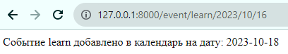

# Задание 1. Конвертеры маршрутов. 

Рассмотрим небольшой пример. Пользователь хочет сделать заказ в интернет-магазине пиццерии. 
Далеко ходить не будем, путь для примера это будет Додо пицца.

Пользователь выбрал товар - это будет пицца 4 сыра. Чтобы посмотреть товар, пользователю необходимо пройти по ссылке
`https://dodopizza.ru/moscow/pizza/pizza-chetyre-syra`, после чего идёт запрос на сервер, 
определятся ответственный обработчик этого запроса и возвращается будущему покупателю информация о товаре. 

Но что мы видим из данной ссылки? 

Если рассмотреть, то мы видим город `moscow` (он определён как город доставки), 
далее идёт категория товара `pizza` и наименование товара `pizza-chetyre-syra`. Т.е. всю вспомогательную информацию 
о желаемом товаре можно получить прямо из адресной строки, а механизм который помогаем получить данную информацию из адресной строки в Django
называется конвертер маршрутов.

Конвертеры маршрутов представляют собой инструменты, которые Django использует для извлечения данных из URL. Они определены в URL-шаблонах и указывают, какие типы данных ожидаются в URL.
Django автоматически разбирает URL и применяет конвертеры для извлечения параметров из URL, которые затем передаются в представления для обработки.

По [умолчанию](https://docs.djangoproject.com/en/4.2/topics/http/urls/#path-converters) Django предоставляет 5 типов конвертеров `str`, `slug`, `int`, `uuid` и `path` маршрутов. 
Конвертеры указываются перед названием параметра в маршруте вида `<конвертер:параметр>`.

Вновь вернёмся к примеру пиццерии и посмотрим как на примере рассмотренного адреса будут работать конвертеры. 

Сначала определим, что за данные мы хотим получить из адреса. В нашем случае это:

* город доставки;
* категория;
* название товара.

Поэтому в нашем обработчике маршрутов можем прописать такой путь и ответственное представление за выдачу информации о товаре.

```python
urlpatterns = [
    ...,
    path('<city>/<category>/<slug:product>', ProductPizzaView.as_view()),
    ...
]
```

Теперь в случае обработки URL `https://dodopizza.ru/moscow/pizza/pizza-chetyre-syra` нашим приложением, то Django разобьёт URL на соответствующие куски.
Затем запишем значения в переменные `city=moscow`, `category=pizza`, `product=pizza-chetyre-syra` и передаст
эти параметры в представление `ProductPizzaView` для дальнейшей обработки.

Можно заметить, что где-то был передан тип конвертера (`<``slug:product>`), а где-то нет (`<city>`).

Если тип конвертера (`str`, `slug`, `int`, `uuid`, `path`) не был передан, то это означает, что этот тип `str`.

## Немного о типах конвертеров

Далее немного поговорим о стандартных типах конвертеров, их целых 5 штук, наверное они чем-то отличаются друг от друга и применяются для своих задач.

Для примера возьмём ссылку `/example/Super link` и посмотрим как поведут себя разные конвертеры.

1. `str`

Если мы используем конвертер `str` (обработчик маршрутов `example/<link>`), то в переменной `link` получим `Super link` вместе с пробелом между словами,
ровно так как и написали, т.е. при помощи `str` можем получить всю информацию, что попала в поле действия конвертера. 
Используйте `str`, когда ваши URL могут содержать произвольные строки, включая пробелы и специальные символы. 

В представление параметр после обработки конвертером `str` передаётся в строковом типе.

2. `slug`

А вот если использовать `slug` (`example/<``slug:link>`) на туже самую ссылку, то Django вообще потеряется и не сможет обработать данный маршрут,
так как когда он обрабатывает `slug`, то хочет видеть только буквы, цифры, подчеркивания или дефисы, но никак не символы "+, -, :, ." и т.д (данные символы не помеха типу `str`).
А вот ссылка `/example/super-link` или `/example/super_link` для `slug` вообще не проблема. На практике чаще можно встретить `slug` ссылки маленькими латинскими буквами разделенными дефисами.  
Используйте `slug`, когда ваши URL должны быть читаемыми и SEO-дружелюбными (дружелюбными для поисковых запросов), а значением является человеко-понятное слово или фраза.

В представление параметр после обработки конвертером `slug` передаётся в строковом типе.

3. `int`

Если использовать `int` (`example/<``int:link>`), то ожидается что в месте применения конвертера будут только цифры, причём берется вся строка до ограничителя адреса `/` или конца ссылки. 
Это значит, что если рассмотреть ссылку `/example/1234`, то в переменной `link` получим целое значение `1234`. 
А если попытаемся прочитать ссылку `/example/1234!`, то просто не сможет обработать путь.

В представление параметр после обработки конвертером `int` передаётся в целочисленном типе.

Но что делать если хотим обработать ссылку `/example/123-456` в которой слева и справа от дефиса могут стоять от 1 до 3 цифр? 
Можно было бы в маршруте прописать (`example/<``int:left>-<``int:right>`), но переменные `left` и `right` никак не ограничены в длине. 
Т.е. равнозначно обработается как `/example/1-234`, так и `/example/1-2345` (хотя говорили об условии чтобы слева и справа стояло от 1 до 3 цифр).

Чтобы обобщить данный маршрут, можно использовать регулярные выражения. 
Да, обработчики маршрутов поддерживают регулярные выражения.

Функцию `path` меняем на `re_path` и пишем регулярное выражение. 

```python
from django.urls import re_path

urlpatterns = [
    ...,
    re_path(r'^example/(?P<left>\d{1,3})-(?P<right>\d{1,3})/$', ...),
    ...
]
```

Однако теперь хоть мы и обобщили маршрут, но потеряли приведение типов, так как после регулярного выражения 
значение переменной `left` и `right` возвращается в строковом типе.

4. `uuid`

Конвертер `uuid` может использоваться для передачи уникальных идентификаторов (UUID) в URL.
В отличие от `int`, он не предполагает, что UUID является целым числом. 

В каноническом представлении UUID изображают в виде числа в шестнадцатеричной системе счисления, разделённого дефисами на пять групп в формате 8-4-4-4-12 (количество знаков). 
Как пример `/example/123e4567-e89b-12d3-a456-426655440000`, тогда маршрут будет `/example/<``uuid:key>`.
UUID разработаны таким образом, чтобы быть универсально уникальными в пространстве и времени, поэтому нашли
широкое применение для идентификации записей.

В представление параметр после обработки конвертером `uuid` передаётся в объекте Python UUID.

5. `path`

Конвертер `path` может использоваться для передачи путей и ссылок, так как соответствует любой непустой строке, 
включая разделитель пути `'/'`. Это позволяет сопоставлять полный путь URL-адреса, а не его сегмент, как в случае с `str`.
Как пример `/example/my/life/my/rules/public`, тогда маршрут будет `/example/<``path:link>/public`, а в переменной `link` будет значение
`my/life/my/rules`.

В представление параметр после обработки конвертером `path` передаётся в строковом типе.

## Комбинирование разных типов конвертеров

Вы можете комбинировать и использовать разные конверторы для обработки URL, допустим на примере данного адреса
`example/new-blog/1--075194d3-6885-417e-a8a8-6c931e272f00` маршрут можно записать как
`example/<``slug:name>/<``int:idx>--<``uuid:value>` и уже использовать параметры `name='new-blog'`, `idx=1`, `value='075194d3-6885-417e-a8a8-6c931e272f00'` в представлении.

## Работа с датой в адресе

Если походить по окрестностям интернета, то можно встретить URL, в которых явно прослеживается, дата или время
в том или ином виде, допустим часто это можно встретить на новостных порталах.

Как пример:

* `https://ria.ru/20230930/internet-1899166202.html`

Здесь дата 30 сентября 2023 года отдельно стоит между `ria.ru/` и `/internet-1899166202.html`

Если бы мы писали маршрут, то всю необходимую информацию в самом простом виде могли бы получить как

`<date>/<page>`. В `date` запишется строковое значение `'20230930'`, в `page` запишется `'internet-1899166202.html'`

* `https://www.cnews.ru/news/line/2023-06-15_yandeks_praktikum_vyhodit`

Здесь уже 15 июня 2023 работает совместно с `yandeks_praktikum_vyhodit` и маршрут теперь может быть описан как

`news/line/<date>_<``slug``:page``>`. В `date` запишется строковое значение `'2023-06-15'`, в `page` запишется `'yandeks_praktikum_vyhodit'`

Из текста мы поняли, что в Django нет специального типа конвертера для работы c датой. Можно задаться вопросом, а зачем вообще в адресной 
строке передавать время или дату?

Использование даты в адресе URL может быть полезным в различных сценариях и для решения разных задач. Рассмотрим несколько примеров, 
когда такое использование может пригодиться:

* `События и мероприятия`: Если ваш веб-сайт предоставляет информацию о событиях, концертах, спортивных мероприятиях и выставках, дата в URL может использоваться для указания даты события. 

Например `example.com/events/2023-10-15` может быть URL для мероприятия, которое произойдет 15 октября 2023 года.

* `Архив новостей`: В новостных сайтах дата в URL может использоваться для архива новостей. 

Например `example.com/news/2023/10/15` может быть URL для новостной статьи, опубликованной 15 октября 2023 года.

* `Блоги и журналы`: Дата в URL может быть полезной для блогов, журналов и онлайн-дневников. Это позволяет легко структурировать и искать контент по дате публикации.

* `API и RESTful ресурсы`: Если вы разрабатываете RESTful API, дата в URL может использоваться для фильтрации и запросов данных. 

Например `api.example.com/data/2023-10-15` может вернуть данные, связанные с указанной датой.

Из перечисленных примеров можно заметить что есть 2 основных подхода:

* Передача даты в виде параметров даты разделенных дефисом или другим разделителем (`2023-10-15`, `15_10_2023` и т.д.)

* Передача параметров разделенных символом `/` как пример `2023/10/15`

## Работа с датой на примере задачи планирования мероприятий

Рассмотрим составление маршрутов с использованием даты в адресе на примере задачи, 
и заодно посмотрим с чем можем столкнуться в процессе разработки.

Вам поручили разработать функционал сервиса планирования мероприятий.

Данный функционал сервиса по дате проверяет загруженность пользователя и заносит встречу в календарь или переносит её на ближайшую свободную дату. 

Но так как данное приложение только на начальной стадии, поэтому данный функционал это всего лишь гипотеза, которую потом необходимо проверить. 
Иными словами пока нет четкого плана и можно многое что упростить, чем мы и займемся. 

Используем следующие допущения:

* Предположим, что целевая аудитория сервиса, это пользователи которым невыгодно делать 
более одной встречи в день и если встречи накладываются друг на друга, то новая встреча перенесётся на ближайшую свободную дату. 
* При добавлении события вызывается представление с сообщением о том, на какую дату было установлено событие. 
* Проверять, что дата добавления события больше или равна текущей даты не нужно.

С постановкой задачи определились. Воспользуемся предварительно созданной базой данных в виде списка словарей. 
Которая будет описана у нас в `models.py`. В ключе `date` объекта списка у нас будет объект date с днем встречи, а в ключе `event` будет название встречи.

Так же в функции `add_event` приведен код для добавления события в нашу базу данных. По условия оговоренным в допущениях.

```python
# models.py

from datetime import datetime, timedelta

DATABASE = [{"date": datetime(2023, 10, 16), "event": "Поход в театр"},
            {"date": datetime(2023, 10, 17), "event": "Встреча с коллегой"},
            {"date": datetime(2023, 10, 19), "event": "Поход в кино"},
            ]


def add_event(event_date: datetime, event_name: str) -> datetime:
    """
    Добавляет событие в список событий в отсортированном порядке
    :param event_date: дата добавляемого события
    :param event_name: имя события
    :return: дату когда в итоге добавили событие
    """
    for i, entry in enumerate(DATABASE):  # Перебор по всем датам календаря
        if event_date < entry["date"]:  # Ищем когда дата нового события будет явно меньше даты в текущем индексе
            DATABASE.insert(i, {"date": event_date, "event": event_name})  # Добавляем в календарь это событие
            return event_date  # Возвращаем дату на которое записали событие
        event_date += timedelta(days=1)  # Иначе переносим событие на следующий день
    DATABASE.append({"date": event_date, "event": event_name})  # Если не нашли место до добавляем в конец последней записи календаря
    return event_date

```

Затем необходимо определиться по какому пути пойдём в обработке маршрута, так как данные о дне встречи нам как-то получить необходимо. 
Есть варианты, например:

1. `event/pokupki/2023-10-15`, тогда будет маршрут вида `event/<``slug:event>/<date>`

В данном случае нам нужно будет как-то вычленить год, месяц и день из нашей даты.

Можно пойти по простому пути и использовать split на строковых данных. После необходимо проверить валидность данных, 
так как можно передать неправильные значения, для проверки воспользуемся методом `datetime` из модуля `datetime`.
Но в `datetime` передаются значения в целочисленного вида, поэтому необходимо строковый тип преобразовать в тип `int`

```python
from django.urls import path
from django.http import HttpResponse, HttpRequest
from datetime import datetime
from django.views import View
from .models import add_event


class DateView(View): 
    def get(self, request: HttpRequest, event: str, date: str) -> HttpResponse:   
        year, month, day = date.split("-")
        try:
            date = datetime(int(year), int(month), int(day))
        except ValueError as err:
            HttpResponse(err, status=404)
        date = add_event(date, event).strftime('%Y-%m-%d')  # Приведем наш datetime к виду YYYY-MM-DD для вывода
        return HttpResponse(f"Событие {event} добавлено в календарь на дату: {date}")

urlpatterns = [
    path('event/<slug:event>/<date>', DateView.as_view()),
]
```
Далее вызываем функцию добавления события в базу, `add_event` возвращает дату события в рамках поставленных нами ограничений.
А к дате, что была возвращена из add_event применяется метод `strftime`, который по заданному шаблону приводит печатаемое значение
даты (нужна только дата, без времени). В итоге `date` будет датой строкового типа вида YYYY-MM-DD, которую мы вернём в HttpResponse.


В данных условиях было бы проще, чтобы входные параметры уже были целого типа, тогда можно
было бы сократить код на пару строк. Решение есть можно попробовать использовать url вида
`event/pokupki/2023/10/15`.


2. `event/pokupki/2023/10/15`, тогда будет маршрут вида `event/<``slug:event>/<``int:year>/<``int:month>/<``int:day>`

Как преобразится наш код в этом случае?

```python
from django.urls import path
from django.http import HttpResponse, HttpRequest
from datetime import datetime
from django.views import View
from .models import add_event


class DateView(View): 
    def get(self, request: HttpRequest, event: str, year: int, month: int, day: int, ) -> HttpResponse:  
        try:
            date = datetime(year, month, day)  # Проверяем валидность даты
        except ValueError as err:
            return HttpResponse(err, status=404)  # Дата невалидна - возвращаем ошибку
        date = add_event(date, event).strftime('%Y-%m-%d')  # Приведем наш datetime к виду YYYY-MM-DD для вывода
        return HttpResponse(f"Событие {event} добавлено в календарь на дату: {date}")

urlpatterns = [
    path('event/<slug:event>/<int:year>/<int:month>/<int:day>', DateView.as_view()),
]
```

Разделение даты в маршруте на день, месяц и год сразу, вместо передачи даты одной строкой, имеет несколько преимуществ:

* `Читаемость URL`. Разделение даты на день, месяц и год делает URL более читаемым и информативным для пользователя. Например, `/events/2023/10/15` гораздо понятнее, чем `/events/2023-10-15`.

* `Индексация поисковыми системами`. Разделение даты в URL улучшает SEO (поисковую оптимизацию) и позволяет поисковым системам лучше понимать содержание страницы. Это может помочь улучшить позиции вашего сайта в поисковой выдаче.

* `Легкость обработки`. При разделении даты в маршруте на день, месяц и год, вы можете легко извлекать и обрабатывать эти компоненты в представлении. Это облегчает фильтрацию мероприятий или другой логики, связанной с датой.

* `Гибкость и валидация`. Разделение даты позволяет вам проводить более гибкую валидацию значений дня, месяца и года. Вы можете проверять, что год входит в определенный диапазон, что месяц находится между 1 и 12, и так далее.

* `Простота рефакторинга`. Если в будущем вам потребуется изменить формат даты в URL или добавить дополнительные компоненты (например, часы и минуты), разделение даты позволит вам это сделать без изменения всей логики представления.

* `Работа на клиентской стороне`. Разделение даты делает URL-компоненты более доступными для клиентской стороны (например, JavaScript), что может быть полезно для разработки интерактивных функций и фильтрации данных на стороне клиента.


## Пользовательский конвертер

Давайте представим теперь вариант, то нам необходимо еще одно представление обрабатывающее дату, что тогда получится.

Получится следующее - мы будем вынуждены дублировать код, так как вся проверка проходит непосредственно внутри представления.

Можно ли как-то вынести обработку за представление? Да, можно создать свой конвертер для обработки маршрутов. 
На практике чаще всего пользовательские конвертеры создаются в файле `converters.py`. 

[Пользовательский конвертер](https://docs.djangoproject.com/en/4.2/topics/http/urls/#registering-custom-path-converters) - это класс и в нем есть 3 обязательных момента:

* Атрибут класса `regex`. Содержит регулярное выражение, используемое для захвата параметра;

* Метод экземпляра класса `to_python`. Метод, принимающий строку после проверок регулярным выражением и возвращающий необходимый тип данных. 
В случае невозможности преобразования к необходимому типу - метод должен вызвать `ValueError`. 
Ошибка `ValueError` интерпретируется Django как отсутствие совпадения, и, как следствие, пользователю отправляется ответ 404, если не совпадает другой шаблон URL-адреса;

* Метод экземпляра класса `to_url`. Метод, обрабатывающий преобразование типа Python в строку, которая будет использоваться в URL-адресе. Например, при вызове тега `url` внутри шаблона.
 атрибут и методы Django будет пытаться вызывать метод `to_url` при работе с пользовательскими преобразователями маршрутов.

На примере `example/``<``int:data``>`для конвертора `int` вкратце распишем, что же делает `to_python` и `to_url`.

Возьмём ссылку `example/123`

В `to_python` подаётся строковое значение `'123'` после обработки регулярным выражением, а на выходе метода получаем целочисленное значение 123.

В `to_url` происходит обратное преобразование, мы подаём в `to_url` целочисленное `123`, а на выходе получаем строковое `'123'`.

Вроде всё примитивно, но как быть с более сложными преобразованиями, допустим нам нужен конвертер обрабатывающий тип `slug`, 
но мы не хотим обычное значение после `slug`, а хотим получить список элементов между дефисом. Вот пример.

Есть ссылка `example/moy-super-tovar/`, и хочется в представление передать не строку `moy-super-tovar` как при обычном `slug`, 
а передать список `['moy', 'super', 'tovar']`. Давайте напишем свой конвертер для этого.

Первое с чего начинается это с выделения нужной последовательности с помощью регулярного выражения, оно похоже на `slug` но упростим под нашу задачу,
допустим скажем, что будем рассматривать только латинский алфавит в нижнем регистре, а слова разделены только дефисом, тогда паттерн для регулярного выражения
будет следующим:

```python
regex = r"(?:[a-z-]+)"
```

Затем определим метод `to_python` который получает переменную строкового типа, а возвращается список
```python
def to_python(self, value: str):
    return list(value.split("-"))
```

И определим обратную ей функцию, которая из списка строк возвращает строку, где слова разделены дефисом.

```python
def to_url(self, value: list):
    return "-".join(value)
```

Соберем всё вместе м получим пользовательский конвертер `ListConverter`

```python
class ListConverter:
    """ Пользовательский конвертер маршрутов. """
    regex = r"(?:[a-z-]+)"
    
    def to_python(self, value: str):
        return list(value.split("-"))

    def to_url(self, value: list):
        return "-".join(value)
```

 А ниже уже приведен код нашего пользовательского конвертера для работы с датой. Код описан будто лежит в `converters.py`

```python
# converters.py
import datetime


class DateConverter:
    """ Пользовательский конвертер маршрутов. """
    regex = r"\d{4}/\d{2}/\d{2}"  # Регулярное выражение для формата YYYY/MM/DD
    date_format = '%Y/%m/%d'  # Формат вывода для strptime

    def to_python(self, value: str):
        """ Метод преобразует value, полученный после работы регулярного выражения в python тип. """
        return datetime.strptime(value, self.date_format)

    def to_url(self, value: datetime):
        """ Метод обрабатывает python тип, и возвращает строку, которая будет подставлена в url. """
        return value.strftime(self.date_format)
```
Что в итоге мы написали? 

Так как мы определили атрибут `regex`, то данный паттерн используется для выделения строки из URL адреса.
Затем если строка формата YYYY/MM/DD найдена в URL, то она при помощи метода `to_python` трансформируется в объект `datetime` 
(`date_format` в `datetime.strptime` необходим для того, чтобы указать в каком формате пришли данные, которые необходимо преобразовать в объект `datetime`), 
который внутри проводит проверки на валидность даты. Если проверка невалидна, то возвращается ошибка `ValueError`, которая воспринимается как ошибка распознавания адреса.
Дополнительно созданный нами атрибут `date_format` необходим для корректного вывода даты в формате год/месяц/день.

После того как создан конвертер его необходимо зарегистрировать. 

Регистрация происходит через `register_converter` от `django.urls` следующим способом. 

В `urls.py` там где собираетесь использовать пользовательский конвертер в `register_converter` передайте конвертер и имя которое собираетесь использовать
при передаче в маршрут. Допустим 

```python
# urls.py

from django.urls import path, register_converter

from .views import DateView
from .converters import DateConverter

register_converter(DateConverter, 'date')


urlpatterns = [
    path('event/<slug:event>/<date:dt>', DateView.as_view()),  
]
```

```python
# views.py

from django.http import HttpResponse, HttpRequest
from datetime import datetime
from django.views import View
from .models import add_event


class DateView(View): 
    
    def get(self, request: HttpRequest, event: str, dt: datetime) -> HttpResponse:  
        date = add_event(dt, event).strftime('%Y-%m-%d')  # Приведем наш datetime к виду YYYY-MM-DD для вывода
        return HttpResponse(f"Событие {event} добавлено в календарь на дату: {date}")
    
```
Как видим всё работает, так как в базе 2023/10/16 и 2023/10/17 заняты событиями, а 2023/10/18 свободно.



## Итоги

В данном уроке работы с конверторами маршрутов в Django, мы рассмотрели важные концепции и принципы:

* Конвертеры маршрутов в Django - это мощный инструмент для извлечения данных из `URL` и передачи их в представления для обработки.

* Мы ознакомились со стандартными конвертерами в Django, такими как `str`, `slug`, `int`, `uuid`, `path` 
и узнали, как они могут использоваться для обработки разных типов данных в URL.

* Был представлен пример использования конвертеров в реальном сценарии - интернет-магазине пиццы. 
Мы создали URL-шаблон, в котором применили различные конвертеры для извлечения города доставки, категории и названия товара.

* Показаны более сложные примеры маршрутов, включая использование нескольких параметров в URL. 
Это помогает создавать более гибкие и информативные URL для веб-приложений.

* Мы обсудили, что конвертеры маршрутов в Django могут быть настраиваемыми, и вы можете создавать собственные конвертеры 
для обработки специфических форматов данных на примере работы с форматом времени.

* Решили практическую задачу по составлении календаря событий в заданных ограничениях. 

Использование конвертеров маршрутов позволяет создавать более читаемые, информативные и безопасные URL для вашего веб-приложения. 
Они упрощают извлечение данных из URL и делают ваши маршруты более гибкими и удобными для пользователей.


## Практические задания

Текст практической задачи выложен в `readme.md` папки `precode`.

## Вопросы Quiz

### Вопрос 1: Что такое конвертер маршрутов в Django?

Варианты ответа:

1. Это инструмент для создания анимаций на веб-сайте.

Комментарий: **Неверно**. Конвертер маршрутов не относится к инструментам для создания анимаций на веб-сайте.
Конвертер маршрутов извлекает данные из URL и передаёт их в представление.

2. Это инструмент для извлечения данных из URL и передачи их в представления.

Комментарий: **Верно**. Конвертеры маршрутов представляют собой инструменты, которые Django использует для извлечения данных из URL.

3. Это инструмент для шифрования данных перед отправкой на сервер.

Комментарий: **Неверно**. Конвертер маршрутов не относится к инструментам для шифрования данных перед отправкой на сервер.
Конвертер маршрутов извлекает данные из URL и передаёт их в представление.

4. Это инструмент для создания динамических форм на веб-страницах.

Комментарий: **Неверно**. Конвертер маршрутов не относится к инструментам создания динамических форм на веб-страницах.
Конвертер маршрутов извлекает данные из URL и передаёт их в представление.


### Вопрос 2: Какой из следующих стандартных конвертеров используется по умолчанию, если он не указан явно?

Варианты ответа:

1. str

Комментарий: **Верно**. Если тип конвертера не указан явно, то по умолчанию используется конвертер str.

2. int 

Комментарий: **Неверно**. Для целочисленного конвертера необходимо указывать тип `<int:имя_параметра>`. 
Если тип конвертера не указан явно, то по умолчанию используется конвертер str.

3. date 

Комментарий: **Неверно**. `date` не входит в стандартные типы конвертора Django. 
Если тип конвертера не указан явно, то по умолчанию используется конвертер str.

4. uuid

Комментарий: **Неверно**. Для `uuid` конвертера необходимо указывать тип `<uuid:имя_параметра>`. 
Если тип конвертера не указан явно, то по умолчанию используется конвертер str.


### Вопрос 3: Какие типы данных можно обработать с помощью конвертеров маршрутов из адреса URL?

Варианты ответа:

1. Только целые числа

Комментарий: **Неверно**. Конвертеры маршрутов в Django позволяют обрабатывать только текстовые строки. 
Вспомните, что подаётся на вход метода `to_python` в конвертер

2. Только текстовые строки

Комментарий: **Верно**. Конвертеры маршрутов в Django позволяют обрабатывать только текстовые строки.

3. Любые типы данных

Комментарий: **Неверно**. Конвертеры маршрутов в Django позволяют обрабатывать только текстовые строки.
Вспомните, что на вход метода `to_python` в конвертер подаётся строка полученная после выполнения регулярного выражения.

4. Только даты и время

Комментарий: **Неверно**. Конвертеры маршрутов в Django позволяют обрабатывать только текстовые строки.
Вспомните, что на вход метода `to_python` в конвертер подаётся строка полученная после выполнения регулярного выражения.


### Вопрос 4: Какой из следующих конвертеров подходит для обработки человеко читаемой URL-части, содержащей только латинские буквы, цифры, дефис и подчеркивания?

Варианты ответа:

1. str

Комментарий: **Неверно**. Конвертер str хоть и поддерживает все перечисленные значения, но также
поддерживает любые значения, что можно передать в адресной строке. Конвертер slug используется для обработки URL-частей, 
содержащих только латинские буквы, цифры, дефис и подчеркивания.

2. int

Комментарий: **Неверно**. Конвертер int поддерживает только целые значения адресной строке. 
Конвертер slug используется для обработки URL-частей, содержащих только латинские буквы, цифры, дефис и подчеркивания.

3. slug

Комментарий: **Верно**. Конвертер slug используется для обработки URL-частей, 
содержащих только латинские буквы, цифры, дефис и подчеркивания.

4. uuid

Комментарий: **Неверно**. Конвертер uuid хоть и поддерживает латинские буквы, цифры и дефис, но не поддерживает подчеркивание, 
да и человеко читаемой данную строку не назовешь. Конвертер slug используется для обработки URL-частей, содержащих только латинские буквы, цифры, дефис и подчеркивания.

### Вопрос 5: Какой из стандартных конвертеров правильно написан в маршруте?

Варианты ответа:

1. `example/``<``page:int``>`

Комментарий: **Неверно**. Начала пишется тип `int`, затем имя переменной `page`.

2. `example/``<``float:page``>`

Комментарий: **Неверно**. Нет стандартного типа конвертера `float`. Но есть стандартный тип `int`. 

3. `example/<int;page>`

Комментарий: **Неверно**. ';' не используется как разделитель между типом и названием переменной. Для этого используется ':'. 

4. `example/``<``int:page``>`

Комментарий: **Верно**. Действительно int стандартный тип конвертера 
Django и `:` разделяет тип и названием переменной.


# Задание 2. Сервис «Тайный Санта»

### Архитектура приложение

Архитектура итогового web приложения будет состоять из следующих частей:

* `Внешний интерфейс` (Фронтенд): Веб-страницы, где пользователи могут вводить свои желания, видеть информацию о своем тайном Санте и т.д.

  > Разработка ведется с помощью HTML, CSS, Bootstrap и JavaScript или фреймворка JS, такой, как Node.js.

  > Новые понятия для студента: HTML, CSS, базовые концепции веб-дизайна.
  
* `Серверная часть` (Бэкенд): Приложение, занимающееся обработкой данных о пользователях, тайных Сантах и их желаниях в базе данных. 
В приложении реализуется логика вычисления тайных Сант, логика взаимодействия с листом желаний и взаимодействие с фронтендом. 

  > Разработка приложения ведется с помощью фреймворка Django.

  > Новые понятия для студента: Django, базы данных, маршруты, модели данных.


* `База данных`: Хранит информацию о пользователях, связях между Сантами и их желаниями. 
Django будет взаимодействовать с БД, через ORM (Object-Relational Mapping) - технологии связь объектов Python с объектами БД.

  >  Реляционная БД подбирается под задачи. Если достаточно локальной БД в одном пространстве с приложением, то можно использовать SQLite БД.
Если стоит задача разнесения БД и работы над масштабируемостью проекта, то можно выбрать БД развернутую на выделенном сервере, как пример БД - PostgreSQL.

  > Новые понятия для студента: SQL, ORM.

* `Сервер`: Облачный сервис с возможностью запуска синхронного WSGI или асинхронного ASGI сервера приложений 
который обрабатывает запросы от клиентов, связывает фронтенд и бэкенд.

  > В зависимости от задач можно подобрать сервис под нужны, допустим если необходимо познакомить с минимальной настройкой 
файла wsgi.py для настройки сервера приложений, то можно воспользоваться сервисом `pythonanywhere.com`. 
Если стоит чуть углубиться и отойти от встроенного серверного приложения Django, то можно попробовать сервис `render.com` позволяющий достаточно нативно поработать
с синхронным сервером gunicorn и сильно не задумываться о деплое на сервер, так как все изменения через git подтянутся сами и произойдет автоматическое разворачивание
контейнера с приложением.
  
  > Новые понятия для студента: веб-сервер, сервер приложений.

### Этапы обучения

1. Основы Django. 
   > Основы Web. Установка Django. Структура проекта. 
Развертывание первого проекта. Обработка HTTP запросов. Понятие HTTPRequest, HTTPResponse.


2. Представления и шаблоны. Теги. Статические файлы.
   > Создание представлений. Отображение HTML-шаблонов. Язык шаблонов. 
Передача данных между представлениями и моделями в шаблон. Подготовка первых представлений по работе со списком желаний и
получения информации о тайном Санте.

3. Работа с базой данных. 
   > Проектирование схемы БД, таблицы и связи. Создание моделей данных + миграции. Работа с ORM и языком запросов. 
Создание таблиц в базе данных для обработки листа желаний и сопутствующих таблиц. Работа с данными из БД и шаблонами и представлениями. 
   
4. Формы. Настройка аутентификации и авторизации.
   > Работа с формами. Валидация форм. Работа с авторизационной формой приложения. Подключение сторонних авторизационных систем.


5. Тестирование. Покрытие тестами.
   > Модульное тестирование представлений и моделей. Покрытие тестами. Выявление критических узлов приложения


6. Деплой веб-приложений.
   > WSGI сервер. Настройка Django для production.


### Этап "Представления и шаблоны. Теги. Статические файлы"


#### Образовательные результаты:

На этом этапе студенты должны освоить следующие навыки и знания:

* Создание представлений в Django для отображения информации на веб-страницах;

* Использование HTML-шаблонов для оформления веб-страниц;

* Понимание языка шаблонов Django для вставки данных в HTML-шаблоны;

* Передача данных между представлениями и моделями Django;

* Работа с тегами шаблонов, такими как циклы и условия;

* Включение статических файлов, таких как CSS и JavaScript, в веб-страницы.

#### Время прохождения:

Этот этап может занять примерно 1.5-2 недели обучения, в зависимости от темпа и интенсивности обучения.

#### Промежуточные практические задания:

1. Создайте представление для отображения списка желаний пользователя. 
Используйте HTML-шаблон для структурирования данных и циклы шаблонов для отображения списка желаний.

2. Разработайте представление для получения информации о тайном Санте пользователя. 
Используйте условные операторы в шаблонах для отображения информации о тайном Санте.

3. Добавьте статические файлы (например, CSS-стили) для улучшения внешнего вида веб-страниц. Подключите их к HTML-шаблонам.

#### Количество заданий:

На этом этапе предлагается выдать студентам 3 задания, по одному на каждое из промежуточных практических заданий. 
Это позволит студентам постепенно углублять свои навыки, начиная с базовых представлений и заканчивая более сложными шаблонами с использованием условий и циклов. 
Работа со статическими файлами также важна, так как это часть создания привлекательных веб-страниц.
